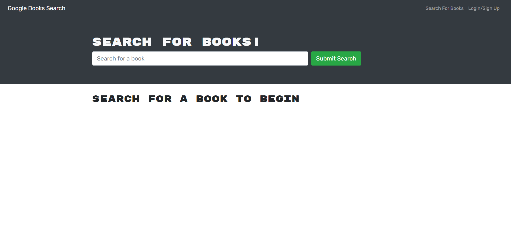

# book-search-engine

## Purpose
Book search engine allows you to create an account and use the google Api to search through books and save them. 

## App Use
Clone repository, and then in the directory from the command line run npm install. Then use the command npm run develop. 

## Built With
* Javascript
* GraphQL
* Express.js
* MongoDb
* Node.js
* React.js

## Live Link

##

## Contribution
Made by Rohith Kurian. 